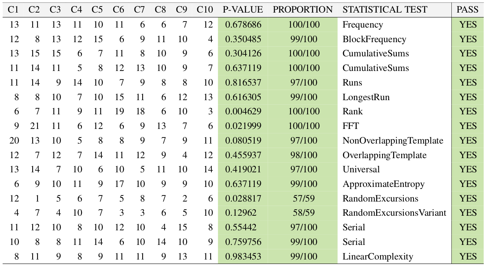
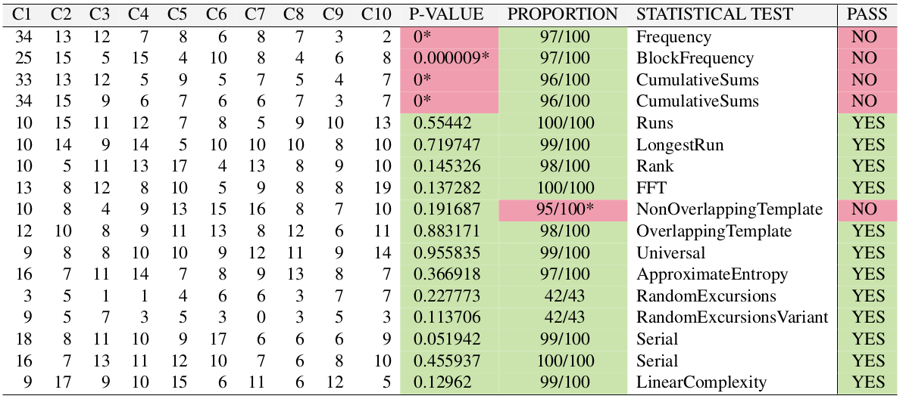
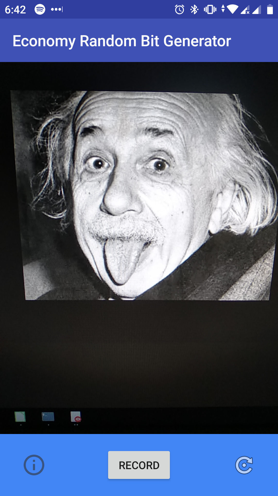
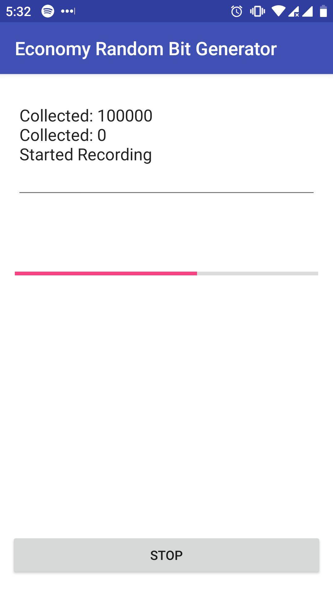

# Economy Random Bit Generator (ERBG)
##### Master's Thesis by Stefan Kutschera

## Abstract
The aim of this Master Thesis at hand is to construct and evaluate a Random Number Generator (RNG), based on entropy
sources available within smartphones, which does not only produce randomness but is also competitive to other
existing and already proved RNGs.

To answer if it is possible to create such an RNG, a prototype with the proposed algorithm, which is also backed up
by the state of the art, was implemented. The outcome of the prototype implementation was then tested against
statistical vulnerabilities with the Statistical Test Suite from NIST.

On one hand the results of the cosmic ray experiment were strong but had severe failures during execution and unexpected
environmental complications while on the other hand the implementation based on gathered audio and video sensors
were successful with some exceptions. These exceptions include the unsolved non-randomness for the video as
entropy source on some other test devices as well as a low random extraction within the audio entropy source.

However, the results showed that the proposed algorithm on entropy sources within a smartphone are competitive in most
cases but need more improvement and a more extended investigation on the non-random output on some devices.
To achieve a true non-deterministic RNG the implementation of the ERBG should additionally use existing smartphone
based muon detection. In order to fulfil the research question regarding the creation of a non-deterministic RNG
the combination of entropy sources such as audio and video as well as muon detection should be considered.

###### Successfull test results from a random extraction process (Fast Forest Circle Spin)
  

###### Unsuccessfull test results from a random extraction process (Meadow Slow Translation)

## Binaries
### EBSO
EBSO is the acronym and stands for Economy Random Bit Generator - Basic Statistic
Output. A helper tool that provides basic statists about a file containing '0' and '1'. 

### ERBG
#### Android Implementation
The main prototype of this Master Thesis was a basic Android App. The ERBG App is capable of gathering raw material out of 
audio or video sources which are then going through a randomness extraction process. This process had brought up two proposal 
for such algorithm.

#### Java Standalone Implementation
The Java Standalone implementation extracts the more general proposed video algorithm. 
It even be used to extract randomness out of every filetype. However, it turned out that in every video within 
this Master Thesis the first ~3250 bits where '0' which was the reason for dumping the first 4000 bits. 
 

# Filestructure

.  
├── data_and_test			[Empirical gathered material (raw, extracted,testresults) during tests]\
"data_and_test" NOT INCUDED WITHIN PUBLIC GIT  
│   ├── all_tests  
│   ├── tools  
│   │   ├── nist_statistical_test_suite  
│   │   └── quantisRNG-2.12.0-Linux-amd64  
│   └── used_within_thesis  
│       ├── erbg_audio_run  
│       ├── erbg_video_C4.2.2_T4.3_Primary_vs_Secondary  
│       ├── erbg_video_Fast_Forest_Circle_Spin  
│       │   ├── xiaomi_marie_C4.2.3_T4.3_Fast_Forest_Circle_Spin  
│       │   └── xiaomi_stefan_Fast_Forest_Circle_Spin  
│       ├── erbg_video_Meadow_Slow_Translation  
│       │   ├── nexus_stefan_C4.2.4_T4.6  
│       │   └── xiaomi_stefan_C4.2.4_T4.5  
│       ├── EXTERNAL_thesis_results_of_braunecker  
│       │   ├── logmap_1m100  
│       │   └── standardmap_1m100  
│       └── qrng_quantis_run  
│           ├── AlgorithmTesting_Binary  
│           └── AlgorithmTesting_ERBG  
├── literature_docs			[Documents and literature used within the Master Thesis]\
"literature_docs" NOT INCUDED WITHIN PUBLIC GIT 
│   ├── bitflipped  
│   ├── docs  
│   │   └── experiment  
│   │       └── usbdump  
│   ├── imagesensors  
│   │   ├── ccd  
│   │   └── cmos  
│   ├── misc  
│   │   └── MA_Braunecker_2012  
│   ├── nist  
│   ├── physics  
│   │   └── Quantum  
│   ├── pictures  
│   ├── projects  
│   │   ├── BlueRand  
│   │   └── quantum_tunneling  
│   └── rng  
│       ├── audioVideoRNG  
│       ├── BlueRand  
│       └── rng_certifications  
├── practical				[Prototype Implementations including source code and binaries/executeables]  
│   ├── ERBG_APP  
│   ├── ERBG_Java  
│   ├── executeable_binaries  
│   │   ├── ebso  
│   │   ├── erbg_android  
│   │   └── erbg_java_standalone  
│   └── Java  
└── thesis				[Sources of Master Thesis]\
"thesis" NOT INCUDED WITHIN PUBLIC GIT  
│   ├── chapters  
│   ├── documents  
│   ├── images  
│   └── src  
└── readme [sources for README.md]  
Master_Thesis_ERBG_Kutschera_printversion.pdf [Master Thesis]

